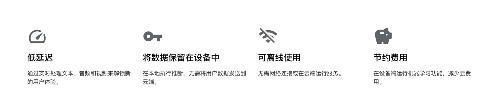

<div align=center>

</div>


# [FaceVerificationSDK](https://github.com/AnyLifeZLB/FaceVerificationSDK)

On_device Offline Android Face Detection 、Recognition 、Liveness Detection Anti Spoofing and 1:N/M:N Face Search SDK 
设备端离线 Android人脸检测、人脸识别、活体检测反作弊以及1:N / M:N人脸搜索 SDK （SDK面向软件开发工程人员，破解灰色行业勿扰，谢谢）



## 当前版本说明 V1.6.0
- 支持自定义双目摄像头搜索
- 解决错误识别问题和其他BUG

 建议[Fork] + [Star] 关注订阅#  [FaceVerificationSDK](https://github.com/AnyLifeZLB/FaceVerificationSDK) 以便获取最新更新

## 简要说明

SDK包含动作活体、静默活体检测，[1：1人脸识别以及1：N , M:N人脸识别检索](https://github.com/AnyLifeZLB/FaceVerificationSDK/blob/main/Face_1:1_1:N_M:N.md)，**所有处理都在设备终端离线执行，SDK本身不用联网，不保存不上传任何人脸信息或其他资料更具隐私安全**

其中活体检测支持张嘴、微笑、眨眼、摇头、点头 随机两种组合验证（摇头点头也可拆分为左右上下4个动作），低端机离线验证速度正常。

SDK支持Android 5+，实验室设备2016年低配置魅蓝Note3 ARM Cortex-A53  1.8GHz x4 + ARM Mali T860 图形处理器运行流畅稳定

实验室测试效果能覆盖95% 的中高低端机器，识别成功率>99%；**特殊DIY系统或特殊定制硬件，外接USB摄像头等**如有问题请先提Issues附带系统版本、设备型号、错误log等信息；
或发邮件到anylife.zlb@gmail.com ，VIP用户添加微信ID：18707611416


## [使用场景和区别](https://github.com/AnyLifeZLB/FaceVerificationSDK/blob/main/Face_1:1_1:N_M:N.md)

   【1:1】 移动考勤真人校验，App免密登录，酒店入驻、刷脸支付、刷脸解锁、真人校验

   【1:N】 智能门锁，考勤机，通缉人员行踪搜索，智慧校园、景区、工地、社区、酒店等

   【M:N】 公安布控，人群追踪 监控等等 (Demo 测试可使用图片 res/M:N_Test.png)

    注：1：N & M:N 人脸检索可以独立依赖，体积更小 https://github.com/AnyLifeZLB/FaceSearchSDK_Android

## 接入使用

    //1.首先Gradle 中引入依赖 
    implementation 'io.github.anylifezlb:FaceRecognition:1.?.?'  //升级1.6 以上版本，老版本不维护
    //2.Camera相机的初始化。第一个参数0/1 指定前后摄像头；第二个参数linearZoom [0.1f,1.0f] 指定焦距，默认0.1
    CameraXFragment cameraXFragment = CameraXFragment.newInstance(cameraLensFacing,0.2f);

    ``` 
    //3.人脸识别过程中各种参数的初始化。（更多说明请Github Clone代码体验,）
    
            FaceProcessBuilder faceProcessBuilder = new FaceProcessBuilder.Builder(this)
                .setThreshold(0.8f)                 //threshold（阈值）设置，范围仅限[0.75-0.95]，默认0.8
                .setBaseBitmap(baseBitmap)          //1：1 底片「底片请设置为正脸无遮挡，并如Demo裁剪为仅含人脸」
                .setLiveCheck(true)                 //是否需要活体检测，需要发送邮件，详情参考ReadMe
                .setVerifyTimeOut(10)               //活体检测支持设置超时时间 9-16 秒
                .setMotionStepSize(2)               //随机动作验证活体的步骤个数，支持1-2个步骤
                .setProcessCallBack(new ProcessCallBack() {
                    @Override
                    public void onCompleted(boolean isMatched) {
                         //1：1 人脸识别匹配成功
                    }
                    @Override
                    public void onMostSimilar(String similar) {
                         //人脸检索识别
                    }
                })
                .create();

        faceDetectorUtils.setDetectorParams(faceProcessBuilder);
    ```

   
    更多使用说明下载参考本Repo和下载Demo体验，里面有比较详尽的使用方法，其中 

  
    * NaviActivity  Demo 演示导航页面
    * /verify/目录  1:1 人脸检测识别，活体检测页面
    * /search/目录  1:N 和 M：N 人脸识别搜索页面，人脸库管理
    * 1：N 和 M：N人脸检索可以独立依赖，体积更小 https://github.com/AnyLifeZLB/FaceSearchSDK_Android

    不含活体检测不需要license完全免费，包含活体检测的使用需要你发送邮件到anylife.zlb@gmail.com 申请
    内容包括App名称、简要描述、包名（applicationId）3项内容。


## Demo 下载体验

   最新版体验下载地址： https://www.pgyer.com/faceVerify  
   微信或相机扫码后选择在浏览器中打开点击下载安装，验证是否符合你的业务需求

<div align=center>

</div>

## 服务定制

   如果 SDK 不能匹配你的应用场景需要特殊定制化，请发邮件到anylife.zlb@gmail.com
   也可以加微信 HaoNan19990322 （请标注为 人脸识别 ，否则会自动忽略添加，谢谢）
   
   欢迎关注Fork+Star获取最新动态  Github:  https://github.com/AnyLifeZLB/FaceVerificationSDK
  

## 常见问题
   常见问题请参考：https://github.com/AnyLifeZLB/FaceVerificationSDK/blob/main/questions.md
   只是1:1 人脸识别不含活体检测是不需要申请授权的，直接永久使用；1：N，M：N需要授权，未明事宜请联系
   所有的开发测试都在手机和平板进行，特殊定制硬件如RK3288 等适配需要兼容适配


