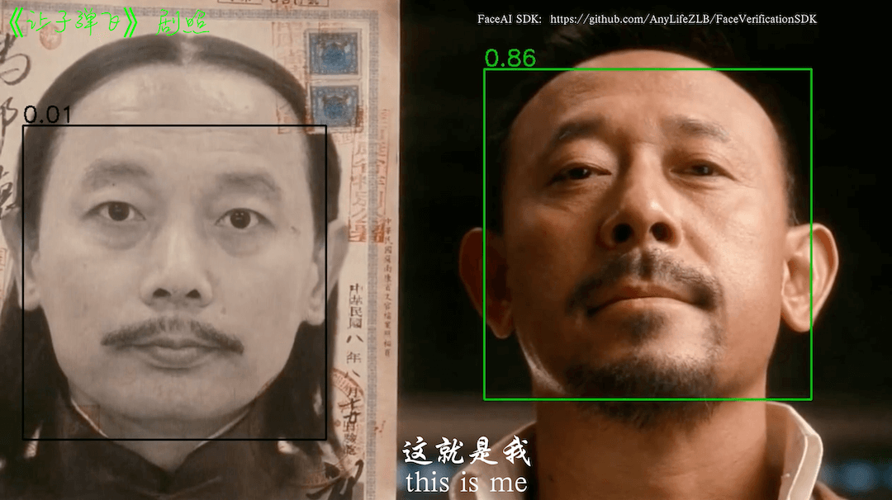

 

 

# [关于「保护伞FaceAI SDK」](https://github.com/AnyLifeZLB/FaceVerificationSDK)

Umbrella FaceAI SDK is on_device Offline Android Face Detection 、Recognition 、Liveness Detection Anti Spoofing and 1:N/M:N Face Search SDK

保护伞FaceAI SDK是设备端可离线不联网Android 人脸识别、动作及近红外IR活体检测、人脸图质量检测以及人脸搜索（1:N和M:N）SDK，可快速集成实现人脸识别，人脸搜索功能。

**iOS SDK：** https://github.com/AnyLifeZLB/FaceAISDK_iOS  
**Uni App：** https://github.com/AnyLifeZLB/UniPlugin-FaceAISDK  
**Android：** https://github.com/AnyLifeZLB/FaceVerificationSDK

## 当前版本说明 V1.10.0 (建议升级到GitHub Demo版本)
- 优化人脸搜索和三方UVC摄像头管理库
- 优化低配设备人脸录入和识别活体校验优化
- 重新构建兼容适配16KB SO库

建议[Fork] + [Star] 本项目Repo以便第一手获取更新：[FaceVerificationSDK](https://github.com/AnyLifeZLB/FaceVerificationSDK)

## 简要说明

SDK包含动作活体、静默活体检测，[1：1人脸识别以及1：N 人脸搜索识别](https://github.com/AnyLifeZLB/FaceVerificationSDK/blob/main/Introduce_11_1N_MN.md)，**所有功能都在设备终端离线执行，SDK本身不用联网，不保存不上传任何人脸信息敏感资料更具隐私安全**

其中活体检测支持张嘴、微笑、眨眼、摇头、点头 随机两种组合验证（支持去除特定的动作），低端机离线验证速度正常，1.9.0已经支持UVC红外双目摄像头。

SDK支持Android(5，15]，建议设备配置 CPU为八核64位2.4GHz以上  摄像头RGB 宽动态镜头分辨率720p以上，帧率大于30并且无拖影。

实验室测试效果能覆盖95%的高中低端手机平板，识别成功率>99%；**特殊DIY系统/定制硬件，如USB摄像头，双目摄像头等**如有问题请先提Issues附带系统版本、设备型号、错误log等信息；
或发邮件到 FaceAISDK.Service@gmail.com ，VIP用户添加 微信：HaoNan19990322 或 WhatsApp: +8618707611416

**SDK 工作原理简介**
FaceAISDK 工作原理根据设置好的人脸识别阈值、识别种类的等参数，从系统相机、USB外接摄像头设备甚至RTSP视频流获取连续连续图像帧转为Bitmap后
送入SDK引擎，同时监听处理SDK返回的各种错误提示和结果。你可以自定义管理视频图像来源，SDK已经演示了系统相机CameraX，USB设备，RTSP流处理。

## [使用场景和区别](https://github.com/AnyLifeZLB/FaceVerificationSDK/blob/main/doc/Introduce_11_1N_MN.md)

【1:1】 移动考勤签到、App免密登录、刷脸授权、刷脸解锁、巡更打卡真人校验

【1:N】 小区门禁、公司门禁、智能门锁、智慧校园、景区、工地、社区、酒店等

【M:N】 公安布控、人群追踪 监控等等 (测试效果可使用 MN_face_search_test.jpg 模拟)

## 接入使用
    先Github 下载最新接入Demo代码导入到Android Studio。  
    Demo 为了演示SDK的核心功能，部分细节并不完善，需要你根据你的业务需求自行完善。

*   1.调整JDK版本到java 17。AS设置Preferences -> Build -> Gradle -> JDK的版本为 17

*   2.最好翻墙科学上网同步AGP Gradle 插件 7.X 这是工程默认设置使用的的,然后同步其他依赖

*   3.Demo工程成功运行后，根据你的业务需求重点熟悉对应模块后再集成到你的主工程

*   4.**集成到你的主工程**，首先Gradle 中引入依赖
    implementation 'io.github.anylifezlb:FaceAISDK:1.9.?' //及时升级到github最新版

*   5.解决项目工程中的第三方依赖库和主工程的冲突比如CameraX的版本等，Target SDK不同导致的冲突

    目前SDK使用**java17. kotlin 1.9.20，AGP 7.x **打包，如果你的项目较老还在使用
    kapt, kotlin-android-extensions导致集成冲突，建议尽快升级项目或者VIP联系定制

    更多使用说明下载SDK源码工程代码到Android Studio 以及下载Demo APK到手机体验完整的流程和效果
    里面有详尽的注释说明和使用方法介绍，SDK源码熟悉完成后有一定Android基础大概3小时可集成到你的主工程

**工程目录结构简要介绍**

| 模块            | 描述                                         |
|---------------|-----------------------------------------------|
| appMain       | 主工程，implementation project(':faceAILib')    |
| faceAILib     | 子Module，FaceAISDK 所有功能都在module 中演示      |
| /verify/\*    | 1:1 人脸检测识别，活体检测页面，静态人脸对比          |
| /search/\*    | 1:N 人脸搜索识别，人脸库增删改管理等财政              |
| /addFaceImage | 人脸识别和搜索共用的添加人脸照片录入模块               |
| /UVCCamera/\* | UVC协议双目红外摄像头人脸识别，人脸搜索，一般是自自定义的硬件   |
| /SysCamera/\* | 手机，平板自带的系统相机，一般系统摄像头打开就能看效果         |

## Demo 下载体验

扫码后选择在浏览器中打开点击下载安装，或直接输入地址 https://www.pgyer.com/faceVerify

## 服务定制

如果SDK不能匹配你的应用场景或需要**特殊双目摄像头活体检测**定制化，请发需求到FaceAISDK.Service@gmail.com  
正式授权可以加微信 [HaoNan19990322 ，备注人脸识别](images/WechatIMG24.jpg)

欢迎关注Fork+Star获取最新动态，提出使用建议等 https://github.com/AnyLifeZLB/FaceVerificationSDK

## 提升接入效率，提高SDK识别准确率

### 提升接入效率

1.  去蒲公英下载APK Demo 体验SDK 的基本功能，看看是否满足业务需求；人脸搜索可以一键导入200+张人脸图再录入你自己的
2.  更新GitHub 最新的代码，花1天左右时间熟悉SDK API 和对应的注释备注，断点调试一下基本功能；熟悉后再接入到主工程
3.  欲速则不达，一定要先跑成功SDK接入指引Demo。熟悉后再接入到主工程验证匹配业务功能；有问题可以GitHub 提issues

### 提高SDK识别准确率

1.  使用宽动态（人脸搜索须大于105DB）抗逆光摄像头；**保持镜头干净（用纯棉布擦拭油污）**
2.  录入高质量的人脸图，可参考（images/face\_example.jpg）
3.  光线环境好否则加补光灯，人脸无遮挡，没有化浓妆 或 粗框眼镜墨镜、口罩等大面积遮挡
4.  人脸图大于 300*300（人脸部分区域大于200*200）五官清晰无遮挡，图片不能有多人脸

## 常见问题
常见问题请参考：https://github.com/AnyLifeZLB/FaceVerificationSDK/blob/main/doc/questions.md  
所有的开发测试都在手机和平板进行，特殊定制硬件如 RK3288 等适配需要兼容适配，SDK1.9.0以上版本已经支持UVC
协议的USB 双目摄像头IR近红外活体，买对应的USB接口的双目摄像头插入手机USB口就能体验效果（不确定品质联系我推荐）

**更多外接USB外接UVC摄像头**的操作参考这个大神的库：https://github.com/shiyinghan/UVCAndroid  
项目中的libs/libuvccamera-release.aar 就是根据此项目微调打包成AAR

## 快速接入
Demo 以main主工程 --> faceAiLib 的方式演示，熟悉本SDK 接入Demo 后可以先Copy faceAiLib到你主工程先跑起来
再根据业务情况修改完善。  
熟悉后大约3小时就能集成成功，丰富产品功能同时可大大降低公司研发投入实现降本增效。

  
